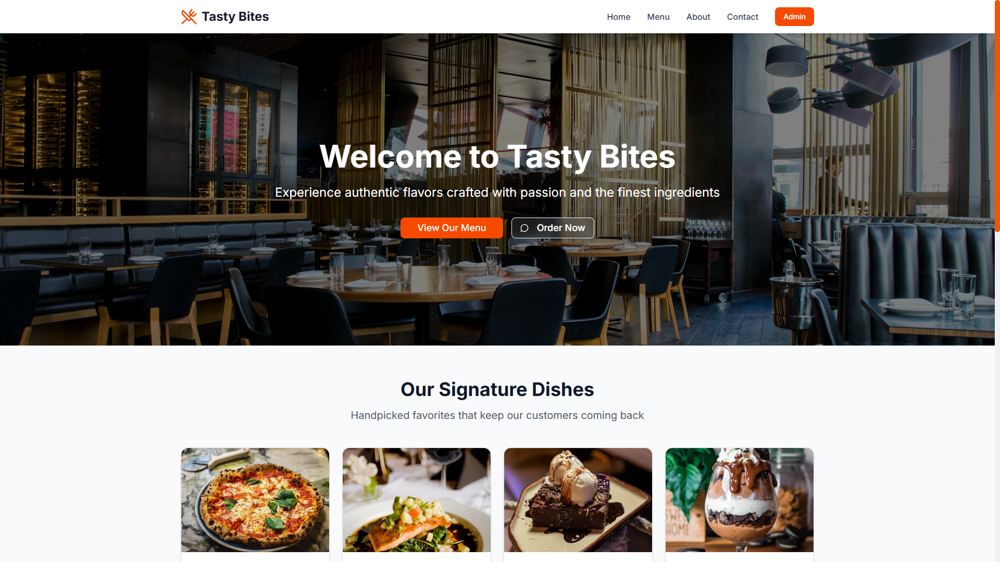

# Restaurant Management System - Full Stack Web Application

> A complete restaurant website with admin panel, built with Next.js 16, TypeScript, and MongoDB

🔗 **Live Demo:** [your-vercel-url.vercel.app](your-url)  
🔗 **Admin Panel:** [your-url]/admin/login  
👤 **Demo Login:** admin@tastybites.com / admin123

## 🎯 What I Built

A production-ready restaurant website that real businesses can use today. Features include online menu management, WhatsApp ordering, search functionality, and a complete admin dashboard.

## ✨ Key Features

### Customer-Facing Website

- 🏠 Beautiful homepage with featured dishes
- 🔍 Real-time menu search and category filtering
- 📱 Fully responsive (mobile, tablet, desktop)
- 💬 WhatsApp ordering integration
- 🗺️ Google Maps integration
- 📧 Contact form with validation

### Admin Panel

- 🔐 Secure JWT authentication
- ➕ Create new menu items
- ✏️ Edit existing items
- 🗑️ Delete items
- ⭐ Mark items as featured
- 📊 Dashboard with statistics

## 🛠️ Technical Stack

**Frontend:**

- Next.js 16 (App Router)
- TypeScript
- Tailwind CSS
- shadcn/ui components
- Server-side rendering for SEO

**Backend:**

- Node.js + Express
- MongoDB Atlas (cloud database)
- JWT authentication
- RESTful API

**Deployment:**

- Frontend: Vercel
- Backend: Render
- Database: MongoDB Atlas

## 📊 Project Stats

- 7 days of development
- 3,000+ lines of code
- 15+ reusable components
- 8 API endpoints
- 100% TypeScript

## 💼 Commercial Value

This type of project typically costs **3,000-5,000 AED** for client work in Dubai.

## 🚀 Quick Start

\`\`\`bash

# Frontend

npm install
npm run dev

# Backend

cd restaurant-backend
npm install
npm run dev
\`\`\`

## 📧 Contact

Built by Vassilly Ibinkwiye  
Available for freelance work!

WhatsApp: +971504930652
Email: ivassillycharite@gmail.com
